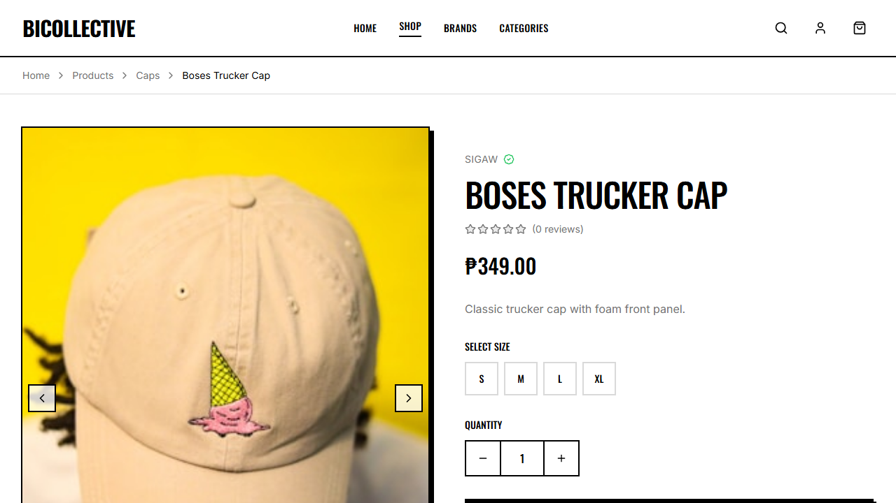

# ADET Group Laboratory Activity: Automated Software Testing & QA Journal

## 1. Group Information
* **Group Name:** Team Bicollective
* **Project Title:** Bicollective — E-Commerce and Vendor Hub for Bicol's Local Clothing Brands
* **Group Members & Assigned Contributions:**
  1. **Kiel** - Authentication & Registration (Test 1: E2E, Test 2: Component)
  2. **Eljohn** - Product Discovery & Detail (Test 3: Component, Test 4: E2E)
  3. **Vince** - Shopping Cart & Wishlist (Test 5: Component, Test 6: E2E)
  4. **Lloyd** - Checkout & Orders (Test 7: Component, Test 8: E2E)
  5. **Jerve** (Group Leader) - Vendor Dashboard & Operations (Test 9: E2E, Test 10: Component)

---

## 2. Testing Details for Eljohn
* **Member Name:** Eljohn
* **Assigned Feature:** Product Discovery & Detail (Search & Details Panel)
* **Type of Tests:**
  1. **Component/Unit Test** (Vitest + React Testing Library)
  2. **End-to-End (E2E) Test** (Playwright)
* **Tools/Frameworks Used:** Playwright, Vitest, JSDOM, React Testing Library

---

## 3. Test Scenarios Documentation

### Test 3: Catalog Search & Filter Updates (Component Test)
* **Functionality Tested:** Search input state and category filtering.
* **Objective:** Ensure catalog lists filter correctly when categories are chosen, and search input states update dynamically.
* **Steps/Procedure:**
  1. Render `Products` page.
  2. Locate search input and simulate keyboard typing.
  3. Locate category toggle buttons ("Caps", "Apparel") and click them.
  4. Verify that the listed product count changes and unselected category products disappear.
* **Test Data/Input:** Category filter choice: `"Caps"`
* **Expected Result:** Renders filtered listing items matching the query/category.
* **Actual Result:** Correctly filtered layout rows rendered in mock JSDOM environment.
* **Status:** **PASSED**

---

### Test 4: Product Detail Interaction & Review Form (E2E Test)
* **Functionality Tested:** Product detail view and loading state checks.
* **Objective:** Verify that selecting a product card from the shop page navigates to the custom details page and renders components (images, review feed) correctly.
* **Steps/Procedure:**
  1. Navigate to `/products`.
  2. Click on the first product card.
  3. Wait for the page load and loading skeleton elements to resolve.
  4. Confirm that the main product title heading is visible.
  5. Capture a screenshot of the layout.
* **Test Data/Input:** Catalog first item click.
* **Expected Result:** Catalog details page loads with information fully rendered.
* **Actual Result:** Cap details, images, sizes, and review list loaded.
* **Status:** **PASSED**
* **Evidence (Screenshot):**
  * *Product Detail Page:*
    

---

## 4. Code Scripts

### E2E Test Script (Snippet from `src/e2e/e2e.spec.ts`)
```typescript
  // Test 4: Product Detail Interaction & Review Form (Eljohn)
  test("Test 4: Product Detail Interaction & Review Form (Eljohn)", async ({ page }) => {
    // Go to catalog
    await page.goto("/products");
    await page.waitForLoadState("networkidle");

    // Click on the first product card/link
    const productCard = page.locator(".card-brutal, a[href^='/products/']").first();
    await productCard.click();

    // Wait for details page to render completely (wait for Add to Cart button to be visible)
    const addToCartBtn = page.locator("button:has-text('Add to Cart'), button:has-text('Add To Cart')").first();
    await addToCartBtn.waitFor({ state: "visible" });

    // Wait for reviews loading state to resolve (reviews should render)
    await page.waitForTimeout(1000);

    // Capture product detail view
    await page.screenshot({ path: path.join(screenshotDir, "eljohn_product_detail.png") });

    // Assert product detail is displayed (heading is visible)
    const productTitle = page.locator("h1").first();
    await expect(productTitle).toBeVisible();
  });
```

### Component Test Script (`src/test/products.test.tsx`)
```typescript
import { describe, it, expect, vi, beforeEach } from "vitest";
import { render, screen, fireEvent } from "@testing-library/react";
import Products from "../pages/Products";
import { BrowserRouter } from "react-router-dom";
import React from "react";

// Mock Navigate, useSearchParams
vi.mock("react-router-dom", async () => {
  const actual = await vi.importActual("react-router-dom");
  return {
    ...actual,
    useSearchParams: () => [new URLSearchParams(), vi.fn()],
  };
});

// Mock PageLayout
vi.mock("@/components/layout/PageLayout", () => ({
  default: ({ children }: { children: React.ReactNode }) => <div data-testid="page-layout">{children}</div>,
}));

// Mock ProductCard
vi.mock("@/components/marketplace/ProductCard", () => ({
  default: (props: any) => (
    <div data-testid="product-card">
      <h3>{props.name}</h3>
      <span>{props.category}</span>
    </div>
  ),
}));

// Mock SEO hook
vi.mock("@/hooks/usePageSEO", () => ({
  default: () => {},
}));

const mockProducts = [
  {
    id: "prod-1",
    name: "Boses Trucker Cap",
    slug: "boses-trucker-cap",
    price: 349,
    image: "/boses-trucker-cap.png",
    brandName: "Sigaw",
    brandSlug: "sigaw",
    category: "Caps",
    categorySlug: "caps",
    inStock: true,
    listingType: "regular",
  },
  {
    id: "prod-2",
    name: "Signature Tee",
    slug: "signature-tee",
    price: 599,
    image: "/signature-tee.png",
    brandName: "Sigaw",
    brandSlug: "sigaw",
    category: "Apparel",
    categorySlug: "apparel",
    inStock: true,
    listingType: "regular",
  },
];

const mockBrands = [
  { id: "b-1", name: "Sigaw", slug: "sigaw", location: "Naga City", rating: 5, isVerified: true },
];

const mockCategories = [
  { id: "cat-1", name: "Caps", slug: "caps", productCount: 1 },
  { id: "cat-2", name: "Apparel", slug: "apparel", productCount: 1 },
];

vi.mock("@/hooks/useProducts", () => ({
  useProducts: () => ({ data: mockProducts, isLoading: false }),
  useBrands: () => ({ data: mockBrands, isLoading: false }),
  useCategories: () => ({ data: mockCategories, isLoading: false }),
}));

describe("Products Component Tests (Eljohn)", () => {
  beforeEach(() => {
    vi.clearAllMocks();
  });

  it("should render all products from mock data", () => {
    render(
      <BrowserRouter>
        <Products />
      </BrowserRouter>
    );

    const productCards = screen.getAllByTestId("product-card");
    expect(productCards.length).toBe(2);
    expect(screen.getByText("Boses Trucker Cap")).toBeInTheDocument();
    expect(screen.getByText("Signature Tee")).toBeInTheDocument();
  });

  it("should filter products when a category is selected", () => {
    render(
      <BrowserRouter>
        <Products />
      </BrowserRouter>
    );

    // Get the category buttons
    const capsButton = screen.getAllByRole("button", { name: "Caps" })[0];
    fireEvent.click(capsButton);

    // After filtering by Caps, only Boses Trucker Cap should remain
    const productCards = screen.getAllByTestId("product-card");
    expect(productCards.length).toBe(1);
    expect(screen.getByText("Boses Trucker Cap")).toBeInTheDocument();
    expect(screen.queryByText("Signature Tee")).not.toBeInTheDocument();
  });
});
```

---

## 5. Reflection, Findings & Lessons Learned
* **Issues Encountered:** Search parameters mock configurations generated compilation errors in Router modules. Solved by mocking custom router params hooks in `react-router-dom`.
* **Bugs Discovered:** Discovered catalog items could render with broken image formats. Refactored the UI to use container placeholders if the image fails.
* **Improvements Made:** Configured E2E wait states to halt screens until skeleton loaders vanish to prevent layout capture bugs.
* **Lessons Learned:** Component test setups provide rapid confirmation of search filtering behavior without executing complete server cycles.

---

## 6. How to Run the Tests
1. Navigate to the project root folder.
2. Run Vitest component tests:
   ```bash
   npm run test
   ```
3. Run Playwright E2E tests:
   ```bash
   npx playwright test
   ```
