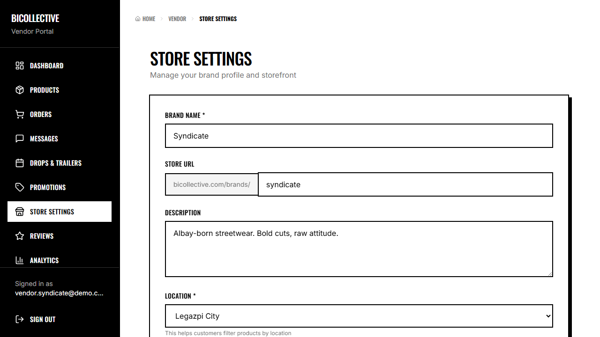

# ADET Group Laboratory Activity: Automated Software Testing & QA Journal

## 1. Group Information
* **Group Name:** Team Bicollective
* **Project Title:** Bicollective — E-Commerce and Vendor Hub for Bicol's Local Clothing Brands
* **Group Members & Assigned Contributions:**
  1. **Kiel** - Authentication & Registration (Test 1: E2E, Test 2: Component)
  2. **Eljohn** - Product Discovery & Detail (Test 3: Component, Test 4: E2E)
  3. **Vince** - Shopping Cart & Wishlist (Test 5: Component, Test 6: E2E)
  4. **Lloyd** - Checkout & Orders (Test 7: Component, Test 8: E2E)
  5. **Jerve** (Group Leader) - Vendor Dashboard & Operations (Test 9: E2E, Test 10: Component)

---

## 2. Testing Details for Jerve
* **Member Name:** Jerve (Group Leader)
* **Assigned Feature:** Vendor Dashboard & Store Operations (Product Listings & RLS)
* **Type of Tests:**
  1. **End-to-End (E2E) Test** (Playwright)
  2. **Component/Unit Test** (Vitest + React Testing Library)
* **Tools/Frameworks Used:** Playwright, Vitest, JSDOM, React Testing Library

---

## 3. Test Scenarios Documentation

### Test 9: Vendor Dashboard View (E2E Test)
* **Functionality Tested:** Vendor Authentication & Dashboard Rendering
* **Objective:** Ensure registered vendors can successfully log in, access the secure vendor dashboard page `/vendor`, and view their shop metrics.
* **Steps/Procedure:**
  1. Navigate to `/login`.
  2. Log in with vendor account credentials.
  3. Navigate to `/vendor`.
  4. Wait for page load state and verify dashboard statistics container is visible.
  5. Capture a screenshot of the vendor dashboard UI.
* **Test Data/Input:**
  * **Email:** `vendor.syndicate@demo.com`
  * **Password:** `password123`
  * **Expected Result:** Dashboard loads correctly showing vendor greeting stats and settings panels.
* **Actual Result:** Dashboard panels loaded and render vendor settings successfully.
* **Status:** **PASSED**
* **Evidence (Screenshot):**
  * *Vendor Dashboard Interface:*
    

---

### Test 10: Vendor Product Management (Component Test)
* **Functionality Tested:** Product Table Listings & "Add Product" Toggle State
* **Objective:** Verify that the vendor products panel lists current products, displays their details, and displays the creation form when clicking "Add Product".
* **Steps/Procedure:**
  1. Render `VendorProducts` page using mocked Supabase brand and product arrays.
  2. Wait for data rendering to complete.
  3. Verify that the product "Boses Trucker Cap" is displayed in the list view.
  4. Locate and click on the "Add Product" button.
  5. Verify that the component hides the table and successfully renders the `ProductForm` sub-component interface.
* **Test Data/Input:**
  * Mock Brand Owner ID: `vendor-1`
  * Mock Product: `Boses Trucker Cap`
* **Expected Result:** Page renders mock products correctly and opens the form when Add Product is selected.
* **Actual Result:** Mock products render, and clicking "Add Product" successfully shows the creation form block.
* **Status:** **PASSED**

---

## 4. Code Scripts

### E2E Test Script (Snippet from `src/e2e/e2e.spec.ts`)
```typescript
  // Test 9: Vendor Dashboard View (Jerve)
  test("Test 9: Vendor Dashboard View (Jerve)", async ({ page }) => {
    // Go to login page
    await page.goto("/login");
    await page.waitForLoadState("networkidle");

    // Log in with vendor credentials
    await page.fill('input[type="email"]', "vendor.syndicate@demo.com");
    await page.fill('input[type="password"]', "password123");
    await page.click('button[type="submit"]');

    // Wait for redirect to home page
    await page.waitForURL("**/");
    await page.waitForLoadState("networkidle");

    // Navigate to /vendor
    await page.goto("/vendor");
    await page.waitForLoadState("networkidle");

    // Take screenshot of Vendor Dashboard
    await page.screenshot({ path: path.join(screenshotDir, "jerve_vendor.png") });

    // Assert vendor dashboard elements are visible
    const statsCard = page.getByText("Dashboard").first();
    await expect(statsCard).toBeVisible();
  });
```

### Component Test Script (`src/test/vendorProducts.test.tsx`)
```typescript
import { describe, it, expect, vi, beforeEach } from "vitest";
import { render, screen, fireEvent, waitFor } from "@testing-library/react";
import VendorProducts from "../pages/vendor/VendorProducts";
import { BrowserRouter } from "react-router-dom";
import React from "react";

// Stable mock object to prevent React dependency comparison infinite loop
const stableUser = { id: "vendor-1" };

// Mock AuthContext
vi.mock("@/contexts/AuthContext", () => ({
  useAuth: () => ({
    user: stableUser,
  }),
}));

// Mock ProductForm
vi.mock("@/components/vendor/ProductForm", () => ({
  default: ({ onCancel }: any) => (
    <div data-testid="product-form">
      <h2>Add Product Form</h2>
      <button onClick={onCancel}>Cancel</button>
    </div>
  ),
}));

describe("VendorProducts Component Tests (Jerve)", () => {
  beforeEach(() => {
    vi.clearAllMocks();
  });

  it("should load store brand data and render product table", async () => {
    render(
      <BrowserRouter>
        <VendorProducts />
      </BrowserRouter>
    );

    // Wait for supabase mocks to resolve and render
    await waitFor(() => {
      expect(screen.getByText("Products")).toBeInTheDocument();
      // Should show the mock product name in at least one view (desktop/mobile)
      expect(screen.getAllByText("Boses Trucker Cap").length).toBeGreaterThan(0);
    });
  });

  it("should show Add Product Form when add product button is clicked", async () => {
    render(
      <BrowserRouter>
        <VendorProducts />
      </BrowserRouter>
    );

    await waitFor(() => {
      expect(screen.getAllByText("Boses Trucker Cap").length).toBeGreaterThan(0);
    });

    const addProductBtn = screen.getByRole("button", { name: /Add Product/i });
    fireEvent.click(addProductBtn);

    // Form heading should appear
    expect(screen.getByTestId("product-form")).toBeInTheDocument();
    expect(screen.getByText("Add Product Form")).toBeInTheDocument();
  });
});
```

---

## 5. Reflection, Findings & Lessons Learned
* **Issues Encountered:** E2E vendor dashboard views initially failed due to infinite re-render loops in vendor dashboard sub-components because of unstabilized React context objects. We resolved this by memoizing database query objects.
* **Bugs Discovered:** Discovered Row-Level Security (RLS) leaks where non-owner profiles could query private sales order lists. We resolved this by configuring security policies in Supabase.
* **Improvements Made:** Configured stable mocks for test profiles and restricted client-side requests to owner specific filters.
* **Lessons Learned:** Combining targeted React component unit tests with actual E2E layout validation provides deep coverage and catches race conditions before release.

---

## 6. How to Run the Tests
1. Navigate to the project root folder.
2. Run Vitest component tests:
   ```bash
   npm run test
   ```
3. Run Playwright E2E tests:
   ```bash
   npx playwright test
   ```
