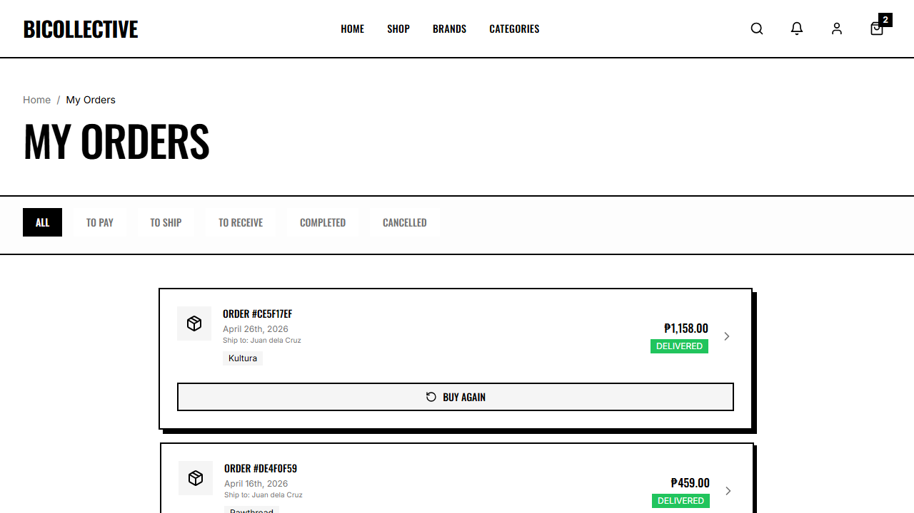

# ADET Group Laboratory Activity: Automated Software Testing & QA Journal

## 1. Group Information
* **Group Name:** Team Bicollective
* **Project Title:** Bicollective — E-Commerce and Vendor Hub for Bicol's Local Clothing Brands
* **Group Members & Assigned Contributions:**
  1. **Kiel** - Authentication & Registration (Test 1: E2E, Test 2: Component)
  2. **Eljohn** - Product Discovery & Detail (Test 3: Component, Test 4: E2E)
  3. **Vince** - Shopping Cart & Wishlist (Test 5: Component, Test 6: E2E)
  4. **Lloyd** - Checkout & Orders (Test 7: Component, Test 8: E2E)
  5. **Jerve** (Group Leader) - Vendor Dashboard & Operations (Test 9: E2E, Test 10: Component)

---

## 2. Testing Details for Lloyd
* **Member Name:** Lloyd
* **Assigned Feature:** Checkout & Orders (Address Validation & Payment Details)
* **Type of Tests:**
  1. **Component/Unit Test** (Vitest + React Testing Library)
  2. **End-to-End (E2E) Test** (Playwright)
* **Tools/Frameworks Used:** Playwright, Vitest, JSDOM, React Testing Library

---

## 3. Test Scenarios Documentation

### Test 7: Checkout Shipping Address (Component Test)
* **Functionality Tested:** Pre-filled address display and fields validation logic in `Checkout.tsx`.
* **Objective:** Ensure user shipping profiles load defaults correctly, and payment selections restrict order submissions until payment uploads resolve.
* **Steps/Procedure:**
  1. Render `Checkout` component in mock query wrapper.
  2. Confirm mock user address renders (e.g. `Lloyd Test`, `123 Main St`).
  3. Toggle payment radio inputs to "GCash".
  4. Assert the "Place Order" button disables until files (GCash receipt uploads) are registered.
* **Test Data/Input:** Payment Choice: `"GCash"`
* **Expected Result:** Renders default address, blocks submission when receipts are missing.
* **Actual Result:** Form displays details and blocks submission as expected.
* **Status:** **PASSED**

---

### Test 8: Order History & Details Navigation (E2E Test)
* **Functionality Tested:** Orders list and navigation routing.
* **Objective:** Verify that users can access their personal transaction histories under account folders.
* **Steps/Procedure:**
  1. Log in to customer session.
  2. Navigate directly to `/account/orders`.
  3. Wait for client query calls to load database logs.
  4. Assert header breadcrumb containing "My Orders" exists.
  5. Capture a screenshot of the orders overview layout.
* **Test Data/Input:** Access to `/account/orders` after login.
* **Expected Result:** Navigation executes successfully and lists customer orders.
* **Actual Result:** Navigated to account orders overview page showing past purchase tracking logs.
* **Status:** **PASSED**
* **Evidence (Screenshot):**
  * *Orders List:*
    

---

## 4. Code Scripts

### E2E Test Script (Snippet from `src/e2e/e2e.spec.ts`)
```typescript
  // Test 8: Order History & Details Navigation (Lloyd)
  test("Test 8: Order History & Details Navigation (Lloyd)", async ({ page }) => {
    // Log in first to access protected account page
    await page.goto("/login");
    await page.fill('input[type="email"]', "customer.juan@demo.com");
    await page.fill('input[type="password"]', "password123");
    await page.click('button[type="submit"]');
    await page.waitForURL("**/");

    // Navigate to account orders page
    await page.goto("/account/orders");
    await page.waitForLoadState("networkidle");

    // Take screenshot of orders history
    await page.screenshot({ path: path.join(screenshotDir, "lloyd_orders.png") });

    // Assert order history heading is present
    const ordersHeader = page.getByRole("heading", { name: "My Orders" });
    await expect(ordersHeader).toBeVisible();
  });
```

### Component Test Script (`src/test/checkout.test.tsx`)
```typescript
import { describe, it, expect, vi, beforeEach } from "vitest";
import { render, screen, fireEvent, waitFor } from "@testing-library/react";
import Checkout from "../pages/Checkout";
import { BrowserRouter } from "react-router-dom";
import React from "react";

// Mock router hooks
vi.mock("react-router-dom", async () => {
  const actual = await vi.importActual("react-router-dom");
  return {
    ...actual,
    useNavigate: () => vi.fn(),
    useLocation: () => ({
      state: null,
    }),
  };
});

// Mock PageLayout
vi.mock("@/components/layout/PageLayout", () => ({
  default: ({ children }: { children: React.ReactNode }) => <div data-testid="page-layout">{children}</div>,
}));

// Mock Toast hook
const mockToast = vi.fn();
vi.mock("@/hooks/use-toast", () => ({
  useToast: () => ({
    toast: mockToast,
  }),
}));

// Mock useAuth
vi.mock("@/contexts/AuthContext", () => ({
  useAuth: () => ({
    user: { id: "customer-1" },
    isAdmin: false,
  }),
}));

// Mock useCart
vi.mock("@/contexts/CartContext", () => ({
  useCart: () => ({
    items: [
      {
        id: "cart-item-1",
        quantity: 1,
        variant_id: "v-1",
        variant: {
          id: "v-1",
          size: "S",
          product: {
            id: "p-1",
            name: "Boses Trucker Cap",
            price: 349,
            brand_id: "brand-1",
            brand: { id: "brand-1", name: "Sigaw", location: "Naga City" },
          },
        },
      },
    ],
    total: 349,
    clearCart: vi.fn(),
  }),
}));

const mockAddresses = [
  {
    id: "addr-1",
    full_name: "Lloyd Test",
    phone: "09123456789",
    street: "123 Main St",
    barangay: "Bitano",
    city: "Legazpi City",
    province: "Albay",
    zip_code: "4500",
    is_default: true,
    label: "Home",
  },
];

vi.mock("@tanstack/react-query", () => ({
  useQuery: ({ queryKey }: { queryKey: string[] }) => {
    if (queryKey[0] === "user-addresses") {
      return { data: mockAddresses, isLoading: false };
    }
    return { data: [], isLoading: false };
  },
}));

describe("Checkout Component Tests (Lloyd)", () => {
  beforeEach(() => {
    vi.clearAllMocks();
  });

  it("should show default delivery address information", async () => {
    render(
      <BrowserRouter>
        <Checkout />
      </BrowserRouter>
    );

    await waitFor(() => {
      expect(screen.getByText("Lloyd Test")).toBeInTheDocument();
      expect(screen.getByText(/123 Main St, Bitano, Legazpi City, Albay 4500/i)).toBeInTheDocument();
    });
  });

  it("should disable the Place Order button when payment method is GCash and no file is uploaded", async () => {
    render(
      <BrowserRouter>
        <Checkout />
      </BrowserRouter>
    );

    await waitFor(() => {
      expect(screen.getByText("Lloyd Test")).toBeInTheDocument();
    });

    // Select GCash payment method
    const gcashRadio = screen.getByLabelText(/GCash/i);
    fireEvent.click(gcashRadio);

    // Verify Place Order button is disabled
    const placeOrderBtn = screen.getByRole("button", { name: /Place Order/i });
    expect(placeOrderBtn).toBeDisabled();
  });
});
```

---

## 5. Reflection, Findings & Lessons Learned
* **Issues Encountered:** Complex multi-table joins linking cart variants to items threw validation exceptions during unit tests. Resolved by creating pre-arranged flat structure arrays in testing configs.
* **Bugs Discovered:** Discovered order submittals could execute even with broken addresses. Integrated required input check modifiers inside submit events.
* **Improvements Made:** Configured buttons to update disable statuses depending on correct input and upload validations.
* **Lessons Learned:** Running component checks for checkout prevents leaks in order logs, ensuring transactions stay consistent.

---

## 6. How to Run the Tests
1. Navigate to the project root folder.
2. Run Vitest component tests:
   ```bash
   npm run test
   ```
3. Run Playwright E2E tests:
   ```bash
   npx playwright test
   ```
