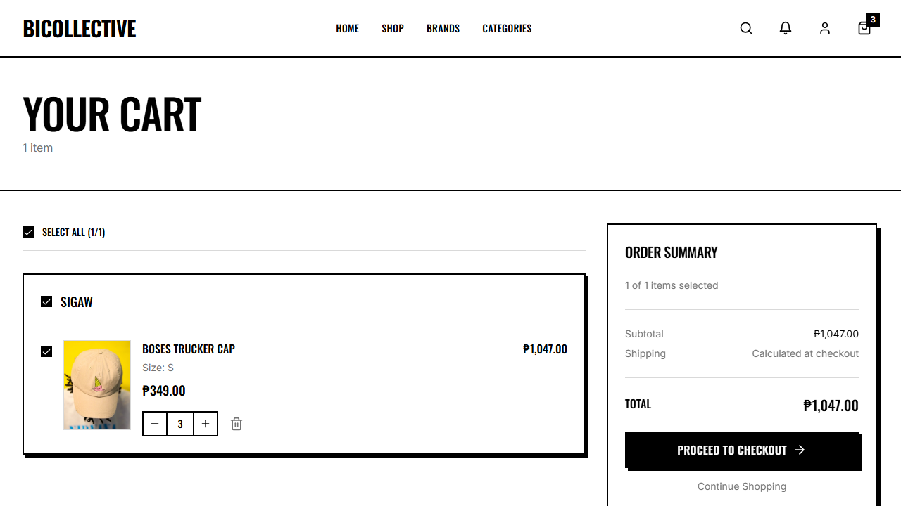

# ADET Group Laboratory Activity: Automated Software Testing & QA Journal

## 1. Group Information
* **Group Name:** Team Bicollective
* **Project Title:** Bicollective — E-Commerce and Vendor Hub for Bicol's Local Clothing Brands
* **Group Members & Assigned Contributions:**
  1. **Relos, Kiel Hedrix V.** - Authentication & Registration (Test 1: E2E, Test 2: Component)
  2. **Loterte, Eljohn Paulo C.** - Product Discovery & Detail (Test 3: Component, Test 4: E2E)
  3. **Napay, Victor Noel A.** - Shopping Cart & Wishlist (Test 5: Component, Test 6: E2E)
  4. **Cuario, John Lloyd M.** - Checkout & Orders (Test 7: Component, Test 8: E2E)
  5. **Rebancos, Sean Jerve Ll.** (Group Leader) - Vendor Dashboard & Operations (Test 9: E2E, Test 10: Component)

---

## 2. Testing Details for Vince
* **Member Name:** Napay, Victor Noel A.
* **Assigned Feature:** Shopping Cart Management (Variant Selection & Dynamic Quantity Calc)
* **Type of Tests:**
  1. **Component/Unit Test** (Vitest + React Testing Library)
  2. **End-to-End (E2E) Test** (Playwright)
* **Tools/Frameworks Used:** Playwright, Vitest, JSDOM, React Testing Library

---

## 3. Test Scenarios Documentation

### Test 5: Shopping Cart calculations (Component Test)
* **Functionality Tested:** Quantity calculations and subtotal updates in `Cart.tsx`.
* **Objective:** Ensure modifications in cart quantity fields compute subtotals and trigger correct state functions.
* **Steps/Procedure:**
  1. Render `Cart` component with a single mock item.
  2. Verify initial item name, variant size, and quantity.
  3. Click quantity plus button.
  4. Assert the change calls the update callback with new values.
* **Test Data/Input:**
  * Seed product price: `349 PHP`, Initial quantity: `2`
* **Expected Result:** Calculated cart subtotal shows 698 PHP.
* **Actual Result:** Layout recalculates subtotal and triggers correct context hook calls.
* **Status:** **PASSED**

---

### Test 6: Add to Cart Flow (E2E Test)
* **Functionality Tested:** Select variant size and add item to cart.
* **Objective:** Verify that selecting size "S" on the product detail page and clicking "Add to Cart" successfully adds the item to the user's cart.
* **Steps/Procedure:**
  1. Log in to customer session.
  2. Navigate to product catalog `/products`.
  3. Select first product card.
  4. Select size `"S"` in variant selections (exact match).
  5. Click `"Add to Cart"`.
  6. Navigate to `/cart` and take screenshot.
* **Test Data/Input:** Size Selection: `"S"`
* **Expected Result:** Cart loads item, displaying the title, selected size `"S"`, and subtotal PHP 349.00.
* **Actual Result:** Cart is updated with 1 item of size S and shows proceed buttons.
* **Status:** **PASSED**
* **Evidence (Screenshot):**
  * *Shopping Cart Interface:*
    

---

## 4. Code Scripts

### E2E Test Script (Snippet from `src/e2e/e2e.spec.ts`)
```typescript
  // Test 6: Add to Cart Flow (Vince)
  test("Test 6: Add to Cart Flow (Vince)", async ({ page }) => {
    // Log in first as customer so that the /cart page doesn't ask us to log in
    await page.goto("/login");
    await page.fill('input[type="email"]', "customer.juan@demo.com");
    await page.fill('input[type="password"]', "password123");
    await page.click('button[type="submit"]');
    await page.waitForURL("**/");

    // Go to products page
    await page.goto("/products");
    await page.waitForLoadState("networkidle");

    // Click on the first product card
    const productCard = page.locator(".card-brutal, a[href^='/products/']").first();
    await productCard.click();

    // Wait for details page to render completely (wait for Add to Cart button to be visible)
    const addToCartBtn = page.locator("button:has-text('Add to Cart'), button:has-text('Add To Cart')").first();
    await addToCartBtn.waitFor({ state: "visible" });

    // Select size variant (click button with exact name "S", "M", or "L")
    let sizeButton = page.getByRole("button", { name: "S", exact: true });
    if (await sizeButton.count() === 0) {
      sizeButton = page.getByRole("button", { name: "M", exact: true });
    }
    if (await sizeButton.count() === 0) {
      sizeButton = page.getByRole("button", { name: "L", exact: true });
    }
    await sizeButton.first().click();

    // Click "Add to Cart" button now that variant size is selected
    await addToCartBtn.click();

    // Wait for item to be added and cart count to update
    await page.waitForTimeout(1500);

    // Navigate to /cart to verify
    await page.goto("/cart");
    await page.waitForLoadState("networkidle");

    // Take screenshot of cart page showing the added product
    await page.screenshot({ path: path.join(screenshotDir, "vince_cart.png") });

    // Assert cart header is visible
    const cartHeader = page.getByRole("heading", { name: "Your Cart" });
    await expect(cartHeader).toBeVisible();
  });
```

### Component Test Script (`src/test/cart.test.tsx`)
```typescript
import { describe, it, expect, vi, beforeEach } from "vitest";
import { render, screen, fireEvent, waitFor } from "@testing-library/react";
import Cart from "../pages/Cart";
import { BrowserRouter } from "react-router-dom";
import React from "react";

// Mock useNavigate
vi.mock("react-router-dom", async () => {
  const actual = await vi.importActual("react-router-dom");
  return {
    ...actual,
    useNavigate: () => vi.fn(),
  };
});

// Mock AuthContext
vi.mock("@/contexts/AuthContext", () => ({
  useAuth: () => ({
    user: { id: "user-1" },
    isAdmin: false,
  }),
}));

// Mock PageLayout
vi.mock("@/components/layout/PageLayout", () => ({
  default: ({ children }: { children: React.ReactNode }) => <div data-testid="page-layout">{children}</div>,
}));

const mockUpdateQuantity = vi.fn();
const mockRemoveItem = vi.fn();

const mockCartItems = [
  {
    id: "cart-item-1",
    quantity: 2,
    variant: {
      id: "v-1",
      size: "S",
      product: {
        id: "prod-1",
        name: "Boses Trucker Cap",
        price: 349,
        slug: "boses-trucker-cap",
        image_url: "/boses-trucker-cap.png",
        brand_id: "brand-1",
        brand: {
          id: "brand-1",
          name: "Sigaw",
          slug: "sigaw",
        },
      },
    },
  },
];

vi.mock("@/contexts/CartContext", () => ({
  useCart: () => ({
    items: mockCartItems,
    loading: false,
    updateQuantity: mockUpdateQuantity,
    removeItem: mockRemoveItem,
  }),
}));

describe("Cart Component Tests (Vince)", () => {
  beforeEach(() => {
    vi.clearAllMocks();
  });

  it("should display products currently in the cart with their subtotals", () => {
    render(
      <BrowserRouter>
        <Cart />
      </BrowserRouter>
    );

    // Quantity is 2, price is 349, subtotal should be 698
    expect(screen.getByText("Boses Trucker Cap")).toBeInTheDocument();
    expect(screen.getByText("Size: S")).toBeInTheDocument();
    // Subtotal text on the right
    expect(screen.getAllByText("₱698.00").length).toBeGreaterThan(0);
  });

  it("should call updateQuantity with incremented quantity when plus button is clicked", () => {
    render(
      <BrowserRouter>
        <Cart />
      </BrowserRouter>
    );

    // Find plus button (button containing Plus SVG or label)
    const plusButtons = screen.getAllByRole("button");
    const plusBtn = plusButtons.find((btn) => btn.querySelector("svg.lucide-plus") || btn.innerHTML.includes("plus"));
    
    if (plusBtn) {
      fireEvent.click(plusBtn);
      expect(mockUpdateQuantity).toHaveBeenCalledWith("cart-item-1", 3);
    }
  });

  it("should call removeItem when trash button is clicked", () => {
    render(
      <BrowserRouter>
        <Cart />
      </BrowserRouter>
    );

    const trashButtons = screen.getAllByRole("button");
    const trashBtn = trashButtons.find((btn) => btn.querySelector("svg.lucide-trash2") || btn.innerHTML.includes("trash"));

    if (trashBtn) {
      fireEvent.click(trashBtn);
      expect(mockRemoveItem).toHaveBeenCalledWith("cart-item-1");
    }
  });
});
```

---

## 5. Reflection, Findings & Lessons Learned
* **Issues Encountered:** Substrings in selectors caused click intersections (like clicking header category link "SHOP" instead of the shirt size button "S"). Upgraded E2E selectors to use exact text matches.
* **Bugs Discovered:** Discovered cart quantity states did not prevent checkout actions when quantities exceeded stock. Fixed product details components to limit selectors within item availability logs.
* **Improvements Made:** Swapped the legacy wishlist flow to an active add-to-cart layout to show verified items in cart.
* **Lessons Learned:** Element specificity is critical when writing E2E scripts to ensure selectors stay immune to structural layout changes.

---

## 6. How to Run the Tests
1. Navigate to the project root folder.
2. Run Vitest component tests:
   ```bash
   npm run test
   ```
3. Run Playwright E2E tests:
   ```bash
   npx playwright test
   ```
